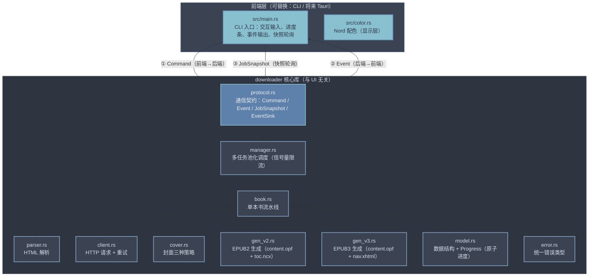
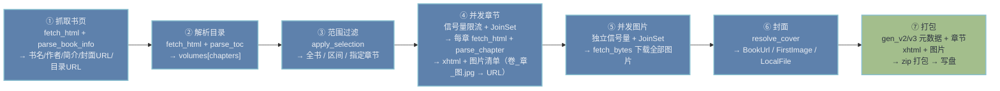

# wenku2epub 架构设计（Rust 版）

## 项目思路

wenku8轻小说文库原生不提供epub格式下载，只提供了TXT, UMD, JAR, JAD这4种格式，均为纯文本，不包含任何图片。其中JAR格式我是用软件查看并不能正常读取图片（可能是软件问题）

唯一结构清晰，内容完整且含有图片的来源是wenku8的网页阅读部分，其中插图单独开了一章，名为插图。所以最方便的构建epub电子书的方式是对wenku8的网页直接进行解析，爬取对应文本和图片来构建电子书。

详细的EPUB3.x标准格式请参考[EPUB 3.3](https://www.w3.org/TR/epub-33/)

详细的EPUB2.x标准格式请参考[EPUB2.0.1](https://idpf.org/epub/20/spec/OPS_2.0_latest.htm)

wenku8轻小说文库可获取的基本信息有：书名，作者，文库，封面，简介，卷名，章节名等。

---

## 网站结构分析（wenku8）

### 小说基本信息获取

解析用户传入的url网址，如[www.wenku8.cc/book/1269.htm](https://www.wenku8.cc/book/1269.htm)。此网页HTML中两个table与2个div分别对应小说网页的

- 标题、文库分类、小说作者、文章状态、最后更新、文库长度
- 封面、作品tag、作品热度、最近章节、内容简介
- 阅读、收藏、支持、专栏、游戏
- 下载相关

通过HTML解析直接获取这些信息，以及小说目录的url链接为后续解析做准备。

### 卷、章节、小说内容、插图

进一步解析用户传入的url中获取的小说目录url。

卷和章节基本使用html的表格标签包裹，并使用链接标签实现跳转

- 全书 class = css
- 卷名 class = vcss
- 章节名称 class = ccss

章节正文位于 `#content` 元素内，图片以 `` 形式出现，相对链接需基于章节页 URL 转为绝对地址。

---

## 整体架构



依赖方向单向：前端 → 核心库；核心库内 manager → book → client/parser/cover/gen_*。

---

## 前后端通信模型（protocol）

核心设计目标：**核心库与 UI 完全解耦**，CLI 与将来的 Tauri 只是同一套契约的两种实现。

| 概念 | 方向 | 内容 |
|---|---|---|
| `Command` | 前端 → 后端 | `CreateJob{url, selection, version}`、`StartJob`、`CancelJob`、`CancelAll`、`RemoveJob`、`GetSnapshot` |
| `Event` | 后端 → 前端 | 低频生命周期信号：`JobCreated`、`JobCompleted`、`JobFailed`、`JobCancelled` |
| `JobSnapshot` | 后端 → 前端（轮询） | 每个任务的完整状态：状态机、阶段、百分比、章节/图片计数、结果路径、错误 |

- **EventSink trait**：前端实现 `emit(Event)`（CLI 打印 / Tauri `app.emit`），核心库通过它推送生命周期事件。
- **快照轮询**：进度是高频数据，不走事件（避免消息开销），前端定时 `get_snapshot()` 拉取即可。

---

## 单本书流水线（book.rs）

`book::generate_book` 串起一本书的完整流程：



各阶段通过 `Progress` 原子计数器上报进度，前端按阶段权重折算全局百分比。

---

## 并发与进度模型

### 并发控制（信号量）

| 层级 | 控制方式 | 默认值 |
|---|---|---|
| 多本书 | `DownloadManager` 池化 `Semaphore`（max_jobs） | 1 |
| 章节并发 | 每任务内 `Semaphore`（concurrency） | 3 |
| 图片并发 | 每任务内独立 `Semaphore`（image_concurrency） | 5 |

章节与图片并发独立配置——图片服务器带宽大，可给更高并发。

### 进度模型（Progress）

```rust
pub struct Progress {
    pub chapters_done: AtomicUsize,   // 已下载章节
    pub chapters_total: AtomicUsize,
    pub images_done: AtomicUsize,     // 已下载图片
    pub images_total: AtomicUsize,
    pub cancel: AtomicBool,           // 取消标志
    stage: AtomicU8,                  // 当前阶段
}
```

- **全部原子变量，无锁**，热路径零开销，不会死锁。
- 核心只写原子值；前端轮询快照读取。
- 取消：前端 `CancelJob` → 置 `cancel=true` → 核心循环检查后停止。

### 全局百分比折算（manager::calc_percent）

不同阶段衡量标准不同（章节按个数、图片按张数），统一折算成 0~100：

```
抓书页 固定 2% → 解析目录 固定 5%
→ 下载章节 10 + 30*done/total（10%→40%）
→ 下载图片 40 + 60*done/total（40%→100%）
→ 打包 100%
```

---

## 网络层（client.rs）

### 请求头

- `html_headers(url)`：完整浏览器特征头（UA 轮换、Referer、Accept-Language、Accept、Sec-Fetch-* 系列、DNT、Upgrade-Insecure-Requests）。
- `image_headers(src)`：图片请求头（UA、Referer、图片 Accept）。
- 图片防盗链：Referer 取图片 URL 的 origin。

### 重试策略（两套）

| 请求类型 | 首次 | 失败后重试 |
|---|---|---|
| `fetch_html`（页面） | 不等待 | 按退避数组 `[50,100,150,200,300,600]` 递增等待；429 前 6 次用数组、之后听 `Retry-After` |
| `fetch_bytes`（图片） | 不等待 | 固定 50ms 后重试 |

统一规则：**4xx 永久错误（403/404 等）直接抛出不重试；网络错误、429、5xx、408 临时错误重试**；最多尝试 `MAX_ATTEMPTS`（10）次，耗尽后统一返回 `url,尝试次数,错误代码` 格式。

---

## EPUB 生成（gen_v2 / gen_v3）

| 版本 | 文件 | 说明 |
|---|---|---|
| EPUB2（`gen_v2.rs`） | `content.opf`（version 2.0）+ `toc.ncx` | spine 引用 `toc="ncx"` |
| EPUB3（`gen_v3.rs`） | `content.opf`（version 3.0）+ `nav.xhtml` | nav 用 `epub:type="toc"` |

版本在 `Command::CreateJob` 中按任务指定（`EpubVersion::V2/V3`），每本书可独立选择。

打包规范：`mimetype` 必须第一个条目且 STORE 不压缩，其余 DEFLATE 压缩；文件结构：

```
mimetype
META-INF/container.xml
OEBPS/content.opf
OEBPS/nav.xhtml 或 toc.ncx
OEBPS/Text/{卷}_{章}.xhtml
OEBPS/Image/{卷}_{章}_{图}.jpg
OEBPS/Image/cover.jpg（可选）
```

---

## 封面策略（cover.rs）

| 策略 | 实现 |
|---|---|
| `BookUrl` | 书页解析出的封面 URL（取 `img.wenku8.com/image/` 下 width 最大者），`fetch_bytes` 下载 |
| `FirstImage` | 第一卷的图片文件名 `0_<章>_<图>.jpg`，按 `(卷,章,图)` 数值排序取第一张 |
| `LocalFile` | 当前目录依次查找 `cover.jpg/jpeg/png/gif/webp/bmp` |

获取失败只跳过封面，不中断整本书生成。

---

## 错误模型（error.rs）

```rust
pub struct Error { pub kind: ErrorKind, pub message: String }
pub enum ErrorKind { Network, Parse, Encode, NotFound, Cancelled }
```

- `message` 必填，调用方必须给出具体原因。
- 实现 `Display`（输出 message）和 `std::error::Error`（可进入通用错误生态）。
- 多本书并发时，单本失败存入自己的 `job.error`，不影响其他任务。
